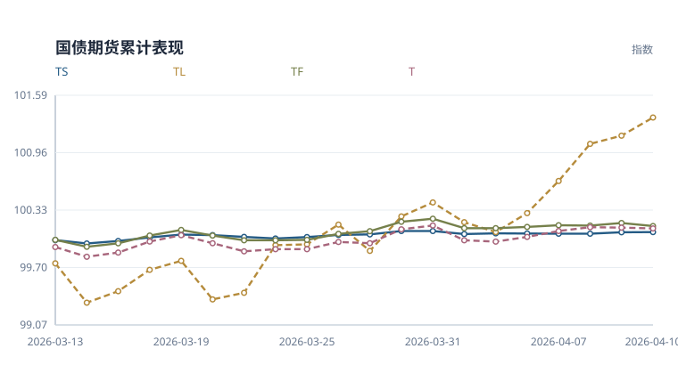
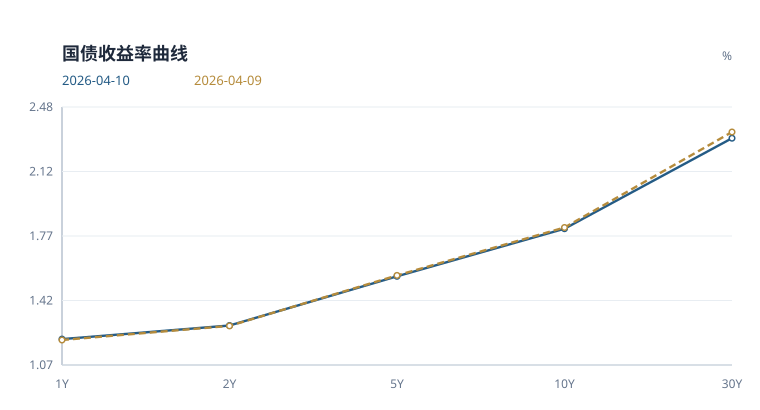
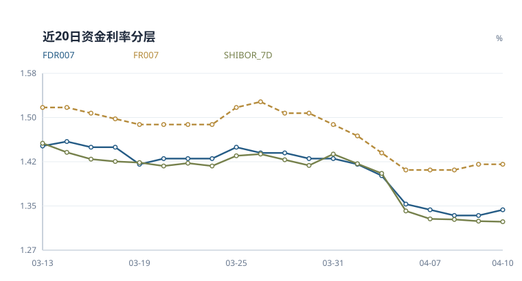
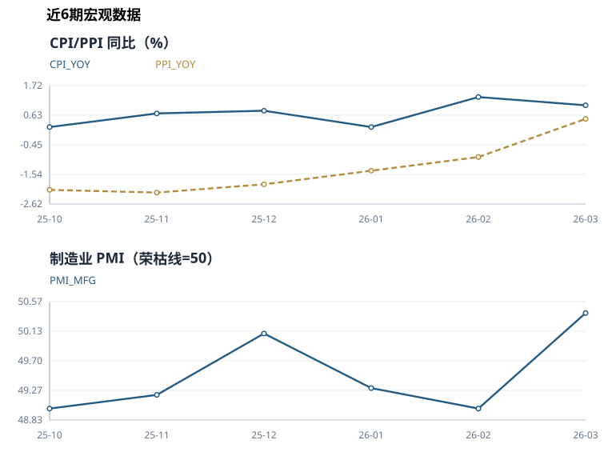

# 国债期货日报

**2026-04-10** · 收盘观察 · 中性偏多

> 基于当日已入库行情与公开数据整理。宏观指标采用当时已发布的数据期。

> 历史重建版：使用当前规则重算，不代表当日实际发布的判断。

## 当日简评

国债期货表现分化。TL 表现相对最强，日收益 +0.196%；TF 为 -0.033%。

10年国债收益率为 1.813%，较上一观测日变化 -0.6 bp。FDR007 为 1.340%，变化 +1.0 bp。央行公开市场当日净投放 10 亿元。

期货量价是本期唯一产生方向性得分的维度，贡献偏多分值。其余可用维度未触发方向性阈值，缺失的文本信号不参与计分。


模型评分 **+1.00** · 规则置信指标 **86/100**

这个指标反映评分输入的覆盖程度和方向一致性，不能解读为上涨概率。

### 关键数字

| 指标 | 当前 | 1日变化 | 5日变化 | 近20次观测分位 |
|---|---:|---:|---:|---:|
| 10Y国债收益率 | 1.813% | -0.6 bp | -0.8 bp | 10% |
| FDR007 | 1.340% | +1.0 bp | -6.0 bp | 20% |
| 期货平均收益 | +0.039% | +0.039% | +0.357% | 50% |
| 总成交量 | 317,510 | +3.3% | 缺失 | 95% |
| 总持仓量 | 708,644 | +2.3% | +6.9% | 100% |

*收益率与资金利率的变化以 bp 计，1 bp 等于 0.01 个百分点。分位只使用已有同口径观测，不足20条时按实际样本计算；缺失比较标为“缺失”。期货5日栏为五次观测的复合收益。*

## 期货表现



*以窗口首个观测日前的100为基准，逐日复合各品种收益率；横轴列出观测日期。*

| 合约 | 日收益 | 持仓变化 | 成交量/均值 | 持仓量/均值 | 量价状态 |
|---|---:|---:|---:|---:|---|
| TS | +0.002% | +1.35% | 1.36x | 1.01x | 价涨增仓 |
| TF | -0.033% | +2.23% | 1.16x | 1.03x | 价跌增仓 |
| T | -0.009% | +1.75% | 1.22x | 1.06x | 价跌增仓 |
| TL | +0.196% | +4.16% | 1.12x | 1.15x | 价涨增仓 |

*均值取当前20次观测窗口内、当日之前的数据。量价状态只描述价格与持仓的同日变化，不据此判断多空开仓。TS、TF、T、TL 分别对应2年、5年、10年和30年期国债期货品种。*

<details>
<summary>查看期货收盘价和成交持仓明细</summary>

| 合约 | 收盘价 | 日收益率 | 成交量 | 持仓量 |
|---|---:|---:|---:|---:|
| TS | 102.482 | 0.0020% | 52,685 | 75,519 |
| TF | 105.925 | -0.0330% | 79,027 | 178,180 |
| T | 108.260 | -0.0092% | 96,470 | 302,927 |
| TL | 112.370 | 0.1962% | 89,328 | 152,018 |

</details>

## 利率与资金

### 国债收益率曲线



| 结构 | 当前 | 1日变化 | 5日变化 |
|---|---:|---:|---:|
| 2s10s | +52.7 bp | -0.9 bp | -0.8 bp |
| 10s30s | +49.3 bp | -2.7 bp | -6.0 bp |
| 2s5s10s蝶式 | -0.8 bp | +0.6 bp | -1.8 bp |

*图中期限按类别等距排列。2s10s 为10年减2年收益率，10s30s 为30年减10年收益率。蝶式采用2年减两倍5年再加10年收益率，均以 bp 表示。*

<details>
<summary>查看各期限收益率与中债、CFETS 核验</summary>

*本日采用中债备用曲线；2年期由1年与3年线性插值，并非直接发布值。涉及2年期的利差与蝶式也含插值成分。*

| 期限 | 收益率 | 较上一观测日 |
|---|---:|---:|
| 1Y | 1.211% | +0.5 bp |
| 2Y | 1.285% | +0.2 bp |
| 5Y | 1.553% | -0.5 bp |
| 10Y | 1.813% | -0.6 bp |
| 30Y | 2.305% | -3.4 bp |

本期缺少两家发布方的可比曲线。

</details>

### 资金利率



| 指标 | 利率 | 较上一观测日 |
|---|---:|---:|
| FDR001 | 1.230% | +0.0 bp |
| FDR007 | 1.340% | +1.0 bp |
| FR007 | 1.420% | +0.0 bp |
| SHIBOR_7D | 1.319% | -0.1 bp |
| SHIBOR_ON | 1.222% | -0.1 bp |

*FDR 与 FR 是定盘利率，与 DR、R 加权成交利率口径不同。*

### 公开市场操作

金额单位为亿元。

| 类型 | 期限 | 投放 | 到期 | 净投放 |
|---|---:|---:|---:|---:|
| 逆回购 | 7 天 | 20 | 10 | +10 |

净投放为负数时表示净回笼。

## 宏观与后续观察

2026-03 的 CPI 为 1.0%，较前期下降 0.3。

2026-03 的 制造业PMI 为 50.4，较前期上升 1.4，高于50荣枯线 0.4。

2026-03 的 PPI 为 0.5%，较前期上升 1.4。




<details>
<summary>查看宏观数据期与历史明细</summary>

| 指标 | 数值 | 数据期 |
|---|---:|---|
| CPI 同比 | 1.00% | 2026-03 |
| LPR 1年期 | 3.00% | 2026-03-20 |
| LPR 5年期以上 | 3.50% | 2026-03-20 |
| 制造业 PMI | 50.40 | 2026-03 |
| PPI 同比 | 0.50% | 2026-03 |

| 数据期 | CPI 同比 | PPI 同比 | 制造业 PMI |
|---|---:|---:|---:|
| 2026-03 | 1.0% | 0.5% | 50.4 |
| 2026-02 | 1.3% | -0.9% | 49.0 |
| 2026-01 | 0.2% | -1.4% | 49.3 |
| 2025-12 | 0.8% | -1.9% | 50.1 |
| 2025-11 | 0.7% | -2.2% | 49.2 |
| 2025-10 | 0.2% | -2.1% | 49.0 |

国家统计局历史数据按日报日期截断，缺项保持缺失。

</details>

本期未取得完整国债发行日历，发行规模和净融资暂不列数。

下一次更新继续观察资金利率、长端收益率和期货持仓是否同向变化。发行日历恢复后，再补充已公告招标安排。

---

## 方法与数据附录

本报告用于整理当日市场信息。评分阈值为 +2 和 -2，区间内保留中性判断。缺少新闻、发行日历等输入时，相关解释范围也会收窄。

<details>
<summary>展开评分依据与历史检验</summary>

| 维度 | 权重 | 分数 | 数据状态 | 判断依据 |
|---|---:|---:|---|---|
| 利率方向 | 2.0 | +0.00 | 可用 | 10Y 收益率变化未超过方向阈值。 |
| 曲线形态 | 0.5 | +0.00 | 可用 | 10Y-2Y 利差处于中性区间。 |
| 资金面 | 1.0 | +0.00 | 可用 | FDR007 变化未超过方向阈值。 |
| 公开市场操作 | 1.0 | +0.00 | 可用 | 净投放/净回笼规模未达到方向阈值。 |
| 期货量价 | 1.0 | +1.00 | 可用 | 期货上涨且成交活跃度提高，量价配合偏积极。 |
| 文本信号 | 1.0 | +0.00 | 缺失 | 缺少政策/新闻文本信号，文本项暂不计分。 |
| 宏观基本面 | 0.5 | +0.00 | 可用 | 制造业 PMI 50.4 处于荣枯线附近，宏观基本面中性。 |

### 风险边界

- 30Y-10Y 曲线偏陡，可能反映超长端供给或期限溢价扰动。
- 规则评分用于研究观察，不提供价格预测或个性化交易建议。

### 历史方向检验

- 历史非零评分记录 116 个，次日方向命中率 56.0%，5日方向命中率 52.6%（n=114）。
- 该检验未扣除交易成本，也未做样本外验证，只用于监测规则是否失效。

这里按评分正负划分方向，包含尚未达到 ±2 阈值的记录。历史评分受数据覆盖和规则版本影响，不等同于当时实际发布的判断。

### 原始特征

| 分组 | 指标 | 数值 |
|---|---|---:|
| 利率 | 10Y 收益率变化 | -0.0064 |
| 利率 | 30Y 收益率变化 | -0.0338 |
| 利率 | 10Y-2Y 利差 | 0.5274 |
| 利率 | 30Y-10Y 利差 | 0.4927 |
| 资金面 | 资金锚名称 | FDR007 |
| 资金面 | 资金锚水平 | 1.3400 |
| 资金面 | 资金锚变化 | 0.0100 |
| 资金面 | 7天回购分层利差 | 0.0800 |
| 资金面 | Shibor 7D-资金锚 | -0.0210 |
| 资金面 | 可用资金利率 | FDR001, FDR007, FR007, SHIBOR_7D, SHIBOR_ON |
| 公开市场操作 | 公开市场净投放 | 10.0000 |
| 公开市场操作 | 公开市场操作利率 | 1.4000 |
| 公开市场操作 | 公开市场操作记录数 | 1 |
| 期货量价 | 期货平均日收益率 | 0.0004 |
| 期货量价 | 成交活跃度变化 | 0.0415 |
| 期货量价 | 覆盖合约数量 | 4 |
| 文本 | 文本情绪均值 | 0.0000 |
| 文本 | 文本信号数量 | 0 |
| 宏观基本面 | LPR 1年期 | 3.0000 |
| 宏观基本面 | LPR 5年期以上 | 3.5000 |
| 宏观基本面 | CPI 同比 | 1.0000 |
| 宏观基本面 | PPI 同比 | 0.5000 |
| 宏观基本面 | 制造业 PMI | 50.4000 |
| 宏观基本面 | 宏观指标数量 | 5 |

</details>

<details>
<summary>展开数据来源、缺项与运行记录</summary>

本期共记录 38 条数据，其中期货 4 条、收益率 5 条、资金利率 5 条。运行状态为 success。

### 数据来源

| 数据类别 | 来源 |
|---|---|
| 国债期货 | `akshare_cffex_daily:20260410` |
| 收益率曲线 | `akshare_bond_china_yield:2026-04-10, akshare_bond_china_yield:2026-04-10:interpolated_1y_3y` |
| 资金利率 | `akshare_chinamoney_repo_rate:2026-04-10, akshare_jin10_shibor:2026-04-10` |
| 公开市场操作 | `pbc_official:https://www.pbc.gov.cn/zhengcehuobisi/125207/125213/125431/125475/2026041009022162073/index.html` |
| 政策/新闻 | 无 |
| 宏观基本面 | `akshare_chinamoney_lpr:2026-03-20, nbs_official_release:2026-03-31:https://www.stats.gov.cn/sj/zxfb/202603/t20260331_1962889.html, nbs_official_release:2026-04-10:https://www.stats.gov.cn/sj/zxfb/202604/t20260410_1963263.html, nbs_official_release:2026-04-10:https://www.stats.gov.cn/sj/zxfb/202604/t20260410_1963264.html` |

公开市场操作采用以下原始记录。

- 公开市场业务交易公告 \[2026\]第68号

### 数据状态

**国债收益率 · 正常**

观测日 未记录，共 5 条。

`bond_yields`

```text
历史数据重建；保留已有真实记录
```

**跨市场数据 · 不可用**

观测日 未记录，共 0 条。

`cross_market`

```text
未取得经验证的历史数据，不作估算
```

**可交割券、基差与 IRR · 不可用**

观测日 未记录，共 0 条。

`ctd_basis_irr`

```text
未取得经验证的历史数据，不作估算
```

**同业存单与 IRS · 不可用**

观测日 未记录，共 0 条。

`funding_ncd_irs`

```text
未取得经验证的历史数据，不作估算
```

**资金利率 · 正常**

观测日 未记录，共 5 条。

`funding_rates`

```text
历史数据重建；保留已有真实记录
```

**国债期货 · 正常**

观测日 未记录，共 4 条。

`futures_quotes`

```text
历史数据重建；保留已有真实记录
```

**国家统计局历史 · 正常**

观测日 2026-04-10，共 18 条。

`macro_history`

```text
历史数据重建；保留已有真实记录
```

**最新宏观指标 · 正常**

观测日 未记录，共 5 条。

`macro_indicators`

```text
历史数据重建；保留已有真实记录
```

**公开市场操作 · 正常**

观测日 未记录，共 1 条。

`open_market_operations`

```text
历史数据重建；保留已有真实记录
```

**政策新闻 · 不可用**

观测日 未记录，共 0 条。

`policy_news`

```text
历史源未补齐；不代表当日无事件，不用现值填补
```

**国债招标结果 · 不可用**

观测日 未记录，共 0 条。

`treasury_auction_results`

```text
未取得经验证的历史数据，不作估算
```

**国债发行日历 · 不可用**

观测日 未记录，共 0 条。

`treasury_issuance_calendar`

```text
历史源未补齐；不代表当日无事件，不用现值填补
```

**双源曲线核验 · 不可用**

观测日 未记录，共 0 条。

`yield_curve_comparisons`

```text
历史源未补齐；不代表当日无事件，不用现值填补
```

### 运行记录

```text
database: data/bond_futures_monitor.db
futures_quotes: 4
bond_yields: 5
funding_rates: 5
open_market_operations: 1
policy_news: 0
macro_indicators: 5
macro_history: 18
treasury_issuance_calendar: 0
yield_curve_comparisons: 0
ai_text_signals: 0
daily_features: 1
daily_market_signals: 1
run_status: success
```

</details>
