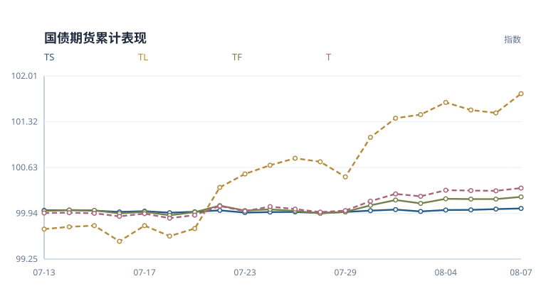
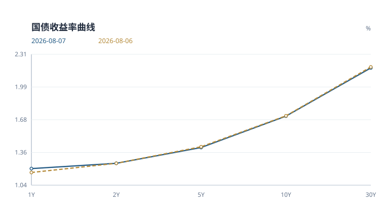
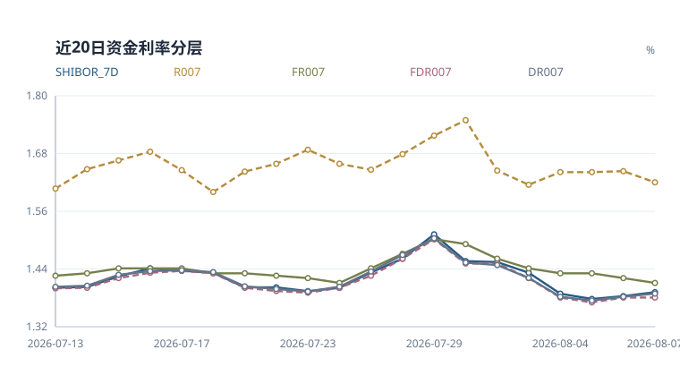
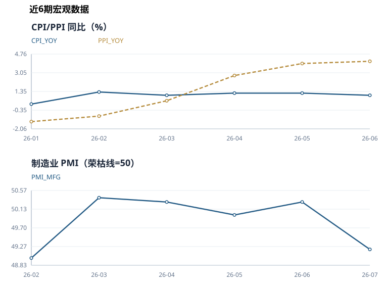

# 国债期货日报

**2026-08-07** · 收盘观察 · 中性偏多

> 基于当日已入库行情与公开数据整理。宏观指标采用当时已发布的数据期。

> 历史重建版：使用当前规则重算，不代表当日实际发布的判断。

## 当日简评

国债期货各品种收涨。TL 表现相对最强，日收益 +0.286%；TS 为 +0.010%。

10年国债收益率为 1.711%，较上一观测日变化 -0.3 bp。FDR007 为 1.380%，变化 +0.0 bp。央行公开市场当日净回笼 1,340 亿元。

模型中的方向性得分来自以下判断。公开市场净回笼 1340 亿元，资金面压力偏空。期货上涨且成交活跃度提高，量价配合偏积极。制造业 PMI 49.2 低于荣枯线，基本面偏弱支撑债市。


模型评分 **+0.50** · 规则置信指标 **87/100**

这个指标反映评分输入的覆盖程度和方向一致性，不能解读为上涨概率。

### 关键数字

| 指标 | 当前 | 1日变化 | 5日变化 | 近20次观测分位 |
|---|---:|---:|---:|---:|
| 10Y国债收益率 | 1.711% | -0.3 bp | -0.1 bp | 5% |
| FDR007 | 1.380% | +0.0 bp | -7.0 bp | 20% |
| 期货平均收益 | +0.092% | +0.092% | +0.129% | 85% |
| 总成交量 | 282,991 | +4.7% | -7.6% | 50% |
| 总持仓量 | 866,857 | +1.3% | -2.9% | 35% |

*收益率与资金利率的变化以 bp 计，1 bp 等于 0.01 个百分点。分位只使用已有同口径观测，不足20条时按实际样本计算；无法比较时注明原因。期货5日栏为五次观测的复合收益，成交量和持仓量5日栏为相对五个交易观测前的变化率。*

## 期货表现



*以窗口首个观测日前的100为基准，逐日复合各品种收益率；横轴列出观测日期。*

| 合约 | 日收益 | 持仓变化 | 成交量/均值 | 持仓量/均值 | 量价状态 |
|---|---:|---:|---:|---:|---|
| TS | +0.010% | +1.68% | 0.91x | 0.97x | 价涨增仓 |
| TF | +0.033% | +0.85% | 0.87x | 0.95x | 价涨增仓 |
| T | +0.041% | +0.58% | 0.89x | 0.98x | 价涨增仓 |
| TL | +0.286% | +2.78% | 1.21x | 1.03x | 价涨增仓 |

*均值取当前20次观测窗口内、当日之前的数据。量价状态只描述价格与持仓的同日变化，不据此判断多空开仓。TS、TF、T、TL 分别对应2年、5年、10年和30年期国债期货品种。*

<details>
<summary>查看期货收盘价和成交持仓明细</summary>

| 合约 | 收盘价 | 日收益率 | 成交量 | 持仓量 |
|---|---:|---:|---:|---:|
| TS | 102.634 | 0.0097% | 36,618 | 86,847 |
| TF | 106.535 | 0.0329% | 56,261 | 213,362 |
| T | 109.425 | 0.0411% | 77,524 | 367,574 |
| TL | 115.720 | 0.2860% | 112,588 | 199,074 |

</details>

## 利率与资金

### 国债收益率曲线



| 结构 | 当前 | 1日变化 | 5日变化 |
|---|---:|---:|---:|
| 2s10s | +45.7 bp | -0.3 bp | +0.4 bp |
| 10s30s | +46.6 bp | -0.7 bp | -0.8 bp |
| 2s5s10s蝶式 | +15.2 bp | +1.2 bp | +0.0 bp |

*图中期限按类别等距排列。2s10s 为10年减2年收益率，10s30s 为30年减10年收益率。蝶式采用2年减两倍5年再加10年收益率，均以 bp 表示。*

<details>
<summary>查看各期限收益率与中债、CFETS 核验</summary>

| 期限 | 收益率 | 较上一观测日 |
|---|---:|---:|
| 1Y | 1.204% | +3.8 bp |
| 2Y | 1.255% | +0.0 bp |
| 5Y | 1.407% | -0.8 bp |
| 10Y | 1.711% | -0.3 bp |
| 30Y | 2.178% | -1.0 bp |

本期缺少两家发布方的可比曲线。

</details>

### 资金利率



| 指标 | 利率 | 较上一观测日 |
|---|---:|---:|
| DR001 | 1.362% | +1.1 bp |
| DR007 | 1.388% | +0.6 bp |
| FDR001 | 1.370% | +2.0 bp |
| FDR007 | 1.380% | +0.0 bp |
| FR007 | 1.410% | -1.0 bp |
| R007 | 1.617% | -2.3 bp |
| SHIBOR_7D | 1.391% | +0.8 bp |
| SHIBOR_ON | 1.361% | +0.8 bp |

*FDR 与 FR 是定盘利率，与 DR、R 加权成交利率口径不同。*

### 公开市场操作

金额单位为亿元。

| 类型 | 期限 | 投放 | 到期 | 净投放 |
|---|---:|---:|---:|---:|
| 逆回购 | 7 天 | 0 | 1,340 | -1,340 |

净投放为负数时表示净回笼。

## 宏观与后续观察

2026-07 的 制造业PMI 为 49.2，较前期下降 1.1，低于50荣枯线 0.8。

2026-06 的 CPI 为 1.0%，较前期下降 0.2。

2026-06 的 PPI 为 4.1%，较前期上升 0.2。




<details>
<summary>查看宏观数据期与历史明细</summary>

| 指标 | 数值 | 数据期 |
|---|---:|---|
| CPI 同比 | 1.00% | 2026-06 |
| LPR 1年期 | 3.00% | 2026-07-20 |
| LPR 5年期以上 | 3.50% | 2026-07-20 |
| 制造业 PMI | 49.20 | 2026-07 |
| PPI 同比 | 4.10% | 2026-06 |

| 数据期 | CPI 同比 | PPI 同比 | 制造业 PMI |
|---|---:|---:|---:|
| 2026-07 | 截至当日未取得发布值 | 截至当日未取得发布值 | 49.2 |
| 2026-06 | 1.0% | 4.1% | 50.3 |
| 2026-05 | 1.2% | 3.9% | 50.0 |
| 2026-04 | 1.2% | 2.8% | 50.3 |
| 2026-03 | 1.0% | 0.5% | 50.4 |
| 2026-02 | 1.3% | -0.9% | 49.0 |

国家统计局历史数据按日报日期截断。各指标发布时间不同，未取得的当期发布值不以之后发布的数据回填。

</details>

本期未取得完整国债发行日历，发行规模和净融资暂不列数。

下一次更新继续观察资金利率、长端收益率和期货持仓是否同向变化。发行日历恢复后，再补充已公告招标安排。

### 政策与新闻

**下周央行公开市场将有1165亿元逆回购到期**

下周央行公开市场将有1165亿元逆回购到期，货币或流动性信号偏紧

货币政策 · 偏空 · 全曲线 · 相关合约 TS, TF, T, TL · 文本置信指标 4/5

下周央行公开市场将有1165亿元逆回购到期可能推高资金利率或收紧预期，国债期货面临压力。

**新能源板块景气持续，“十五五”电网投资超5万亿夯实长期主线，南方基金旗下新能源ETF南方(516160)跟踪标的指数中证新能源指数(399808.SZ)昨日跌1.27%**

新能源板块景气持续，“十五五”电网投资超5万亿夯实长期主线，南方基金旗下新能源ETF南方(516，财政扩张相关信息

财政政策 · 偏空 · 长端 · 相关合约 T, TL · 文本置信指标 3/5

新能源板块景气持续，“十五五”电网投资超5万亿夯实长期主线，南方基金旗下新能源ETF南方(516可能带来债券供给或增长预期扰动，长端期货更敏感。

**沪指重返3900点、科技主线分化轮动，南方基金旗下司南投顾关注美联储政策风格变化**

沪指重返3900点、科技主线分化轮动，南方基金旗下司南投顾关注美联储政策风格变化，货币或流动性信号偏宽

货币政策 · 偏多 · 全曲线 · 相关合约 TS, TF, T, TL · 文本置信指标 4/5

沪指重返3900点、科技主线分化轮动，南方基金旗下司南投顾关注美联储政策风格变化指向流动性边际改善，压低资金和利率预期，对国债期货偏多。

**沪金强势反弹，黄金配置价值凸显，南方基金旗下金ETF南方(159834) 跟踪标的上海金(SHAU.SGE) 涨1.81%**

沪金强势反弹，黄金配置价值凸显，南方基金旗下金ETF南方(159834) 跟踪标的上海金(SHA，货币或流动性信号偏紧

货币政策 · 偏空 · 全曲线 · 相关合约 TS, TF, T, TL · 文本置信指标 4/5

沪金强势反弹，黄金配置价值凸显，南方基金旗下金ETF南方(159834) 跟踪标的上海金(SHA可能推高资金利率或收紧预期，国债期货面临压力。


---

## 方法与数据附录

本报告用于整理当日市场信息。评分阈值为 +2 和 -2，区间内保留中性判断。缺少新闻、发行日历等输入时，相关解释范围也会收窄。

<details>
<summary>展开评分依据与历史检验</summary>

| 维度 | 权重 | 分数 | 数据状态 | 判断依据 |
|---|---:|---:|---|---|
| 利率方向 | 2.0 | +0.00 | 可用 | 10Y 收益率变化未超过方向阈值。 |
| 曲线形态 | 0.5 | +0.00 | 可用 | 10Y-2Y 利差处于中性区间。 |
| 资金面 | 1.0 | +0.00 | 可用 | FDR007 变化未超过方向阈值。 |
| 公开市场操作 | 1.0 | -1.00 | 可用 | 公开市场净回笼 1340 亿元，资金面压力偏空。 |
| 期货量价 | 1.0 | +1.00 | 可用 | 期货上涨且成交活跃度提高，量价配合偏积极。 |
| 文本信号 | 1.0 | +0.00 | 可用 | 新闻文本整体处于中性区间。 |
| 宏观基本面 | 0.5 | +0.50 | 可用 | 制造业 PMI 49.2 低于荣枯线，基本面偏弱支撑债市。 |

多空信号并存：偏多 2 项，偏空 1 项，信号一致性有限。

### 风险边界

- 30Y-10Y 曲线偏陡，可能反映超长端供给或期限溢价扰动。
- 规则评分用于研究观察，不提供价格预测或个性化交易建议。

### 历史方向检验

- 历史非零评分记录 186 个，次日方向命中率 59.1%，5日方向命中率 53.3%（n=182）。
- 该检验未扣除交易成本，也未做样本外验证，只用于监测规则是否失效。

这里按评分正负划分方向，包含尚未达到 ±2 阈值的记录。历史评分受数据覆盖和规则版本影响，不等同于当时实际发布的判断。

### 原始特征

| 分组 | 指标 | 数值 |
|---|---|---:|
| 利率 | 10Y 收益率变化 | -0.0029 |
| 利率 | 30Y 收益率变化 | -0.0097 |
| 利率 | 10Y-2Y 利差 | 0.4566 |
| 利率 | 30Y-10Y 利差 | 0.4665 |
| 资金面 | 资金锚名称 | FDR007 |
| 资金面 | 资金锚水平 | 1.3800 |
| 资金面 | 资金锚变化 | 0.0000 |
| 资金面 | 7天回购分层利差 | 0.0300 |
| 资金面 | Shibor 7D-资金锚 | 0.0110 |
| 资金面 | 可用资金利率 | DR001, DR007, FDR001, FDR007, FR007, R007, SHIBOR_7D, SHIBOR_ON |
| 公开市场操作 | 公开市场净投放 | -1340.0000 |
| 公开市场操作 | 公开市场操作利率 | 原始操作记录未提供该字段 |
| 公开市场操作 | 公开市场操作记录数 | 1 |
| 期货量价 | 期货平均日收益率 | 0.0009 |
| 期货量价 | 成交活跃度变化 | 0.0246 |
| 期货量价 | 覆盖合约数量 | 4 |
| 文本 | 文本情绪均值 | -0.2500 |
| 文本 | 文本信号数量 | 8 |
| 宏观基本面 | LPR 1年期 | 3.0000 |
| 宏观基本面 | LPR 5年期以上 | 3.5000 |
| 宏观基本面 | CPI 同比 | 1.0000 |
| 宏观基本面 | PPI 同比 | 4.1000 |
| 宏观基本面 | 制造业 PMI | 49.2000 |
| 宏观基本面 | 宏观指标数量 | 5 |

</details>

<details>
<summary>展开数据来源、缺项与运行记录</summary>

本期共记录 49 条数据，其中期货 4 条、收益率 5 条、资金利率 8 条。运行状态为 success。

### 数据来源

| 数据类别 | 来源 |
|---|---|
| 国债期货 | `akshare_cffex_daily:20260807` |
| 收益率曲线 | `akshare_bond_china_close_return:2026-08-07` |
| 资金利率 | `akshare_chinamoney_repo_rate:2026-08-07, tushare_repo_daily:20260807, tushare_shibor:20260807` |
| 公开市场操作 | `tushare_news_cls:2026-08-07` |
| 政策/新闻 | `tushare_news_cls:2026-08-07` |
| 宏观基本面 | `akshare_chinamoney_lpr:2026-07-20, nbs_official_release:2026-07-09:https://www.stats.gov.cn/sj/zxfb/202607/t20260709_1964083.html, nbs_official_release:2026-07-09:https://www.stats.gov.cn/sj/zxfb/202607/t20260709_1964084.html, nbs_official_release:2026-07-31:https://www.stats.gov.cn/sj/zxfb/202607/t20260731_1964253.html` |

公开市场操作采用以下原始记录。

- 投资日历：周五资本市场大事提醒

### 数据状态

**国债收益率 · 正常**

观测日 未记录，共 5 条。

`bond_yields`

```text
历史数据重建；保留已有真实记录
```

**跨市场数据 · 不可用**

观测日 未记录，共 0 条。

`cross_market`

```text
未取得经验证的历史数据，不作估算
```

**可交割券、基差与 IRR · 不可用**

观测日 未记录，共 0 条。

`ctd_basis_irr`

```text
未取得经验证的历史数据，不作估算
```

**同业存单与 IRS · 不可用**

观测日 未记录，共 0 条。

`funding_ncd_irs`

```text
未取得经验证的历史数据，不作估算
```

**资金利率 · 正常**

观测日 未记录，共 8 条。

`funding_rates`

```text
历史数据重建；保留已有真实记录
```

**国债期货 · 正常**

观测日 未记录，共 4 条。

`futures_quotes`

```text
历史数据重建；保留已有真实记录
```

**国家统计局历史 · 正常**

观测日 2026-07-31，共 18 条。

`macro_history`

```text
历史数据重建；保留已有真实记录
```

**最新宏观指标 · 正常**

观测日 未记录，共 5 条。

`macro_indicators`

```text
历史数据重建；保留已有真实记录
```

**公开市场操作 · 部分可用**

观测日 2026-08-07，共 1 条。

`open_market_operations`

```text
已剔除周度汇总或未来操作计划的误采记录；仅保留原有当日记录，不将未知操作补为零
```

**政策新闻 · 正常**

观测日 未记录，共 8 条。

`policy_news`

```text
历史数据重建；保留已有真实记录
```

**国债招标结果 · 不可用**

观测日 未记录，共 0 条。

`treasury_auction_results`

```text
未取得经验证的历史数据，不作估算
```

**国债发行日历 · 不可用**

观测日 未记录，共 0 条。

`treasury_issuance_calendar`

```text
历史源未补齐；不代表当日无事件，不用现值填补
```

**双源曲线核验 · 不可用**

观测日 未记录，共 0 条。

`yield_curve_comparisons`

```text
历史源未补齐；不代表当日无事件，不用现值填补
```

### 运行记录

```text
database: data/bond_futures_monitor.db
futures_quotes: 4
bond_yields: 5
funding_rates: 8
open_market_operations: 1
policy_news: 8
macro_indicators: 5
macro_history: 18
treasury_issuance_calendar: 0
yield_curve_comparisons: 0
ai_text_signals: 8
daily_features: 1
daily_market_signals: 1
run_status: success
```

</details>
