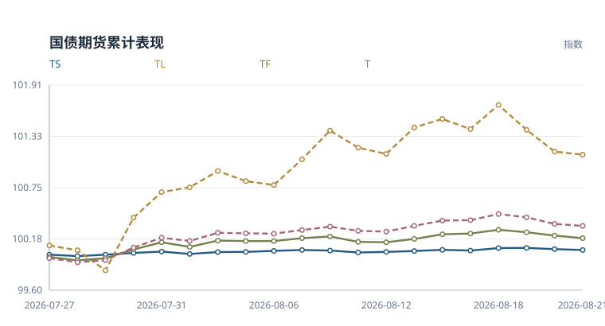
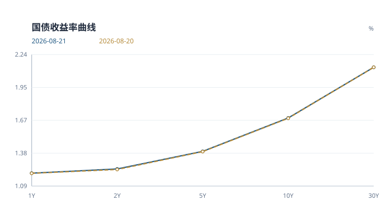
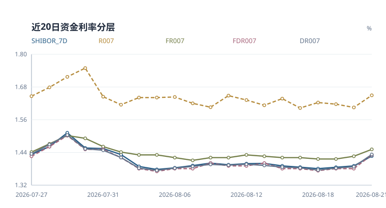
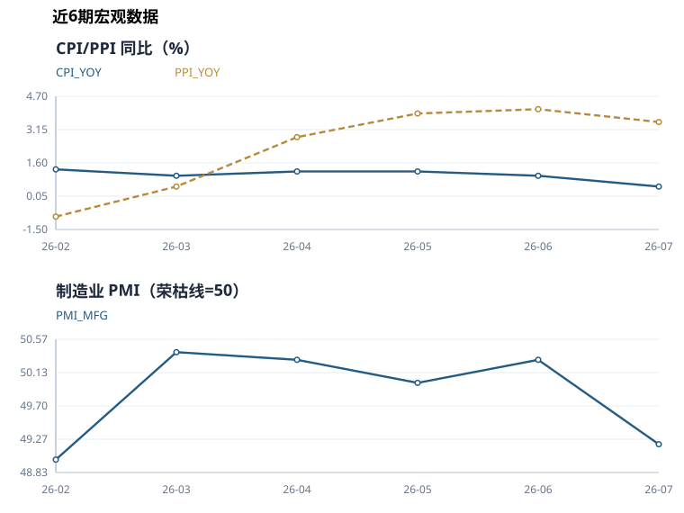

# 国债期货日报

**2026-08-21** · 收盘观察 · 中性偏空

> 基于当日已入库行情与公开数据整理。宏观指标采用当时已发布的数据期。

> 历史重建版：使用当前规则重算，不代表当日实际发布的判断。

## 当日简评

国债期货各品种收跌。TS 表现相对最强，日收益 -0.010%；TL 为 -0.035%。

10年国债收益率为 1.686%，较上一观测日变化 +0.3 bp。FDR007 为 1.430%，变化 +5.0 bp。央行公开市场当日净投放 950 亿元。

模型中的方向性得分来自以下判断。FDR007 上行，银行间资金面边际收紧。公开市场净投放 950 亿元，资金面支持偏多。期货下跌且成交活跃度提高，量价配合偏消极。政策与新闻文本信号整体偏空。制造业 PMI 49.2 低于荣枯线，基本面偏弱支撑债市。


模型评分 **-1.50** · 规则置信指标 **84/100**

这个指标反映评分输入的覆盖程度和方向一致性，不能解读为上涨概率。

### 关键数字

| 指标 | 当前 | 1日变化 | 5日变化 | 近20次观测分位 |
|---|---:|---:|---:|---:|
| 10Y国债收益率 | 1.686% | +0.3 bp | -1.0 bp | 20% |
| FDR007 | 1.430% | +5.0 bp | +5.0 bp | 80% |
| 期货平均收益 | -0.024% | -0.024% | -0.125% | 40% |
| 总成交量 | 483,130 | +5.2% | +67.3% | 100% |
| 总持仓量 | 373,711 | -28.0% | -51.9% | 5% |

*收益率与资金利率的变化以 bp 计，1 bp 等于 0.01 个百分点。分位只使用已有同口径观测，不足20条时按实际样本计算；无法比较时注明原因。期货5日栏为五次观测的复合收益，成交量和持仓量5日栏为相对五个交易观测前的变化率。*

## 期货表现



*以窗口首个观测日前的100为基准，逐日复合各品种收益率；横轴列出观测日期。*

| 合约 | 日收益 | 持仓变化 | 成交量/均值 | 持仓量/均值 | 量价状态 |
|---|---:|---:|---:|---:|---|
| TS | -0.010% | -17.60% | 1.24x | 0.55x | 价跌减仓 |
| TF | -0.028% | -28.34% | 1.67x | 0.47x | 价跌减仓 |
| T | -0.023% | -33.29% | 2.08x | 0.41x | 价跌减仓 |
| TL | -0.035% | -22.94% | 1.19x | 0.51x | 价跌减仓 |

*均值取当前20次观测窗口内、当日之前的数据。量价状态只描述价格与持仓的同日变化，不据此判断多空开仓。TS、TF、T、TL 分别对应2年、5年、10年和30年期国债期货品种。*

<details>
<summary>查看期货收盘价和成交持仓明细</summary>

| 合约 | 收盘价 | 日收益率 | 成交量 | 持仓量 |
|---|---:|---:|---:|---:|
| TS | 102.626 | -0.0097% | 49,714 | 43,968 |
| TF | 106.555 | -0.0281% | 115,624 | 94,484 |
| T | 109.455 | -0.0228% | 198,519 | 141,857 |
| TL | 115.860 | -0.0345% | 119,273 | 93,402 |

</details>

## 利率与资金

### 国债收益率曲线



| 结构 | 当前 | 1日变化 | 5日变化 |
|---|---:|---:|---:|
| 2s10s | +44.9 bp | -0.2 bp | -1.8 bp |
| 10s30s | +44.6 bp | -0.3 bp | -2.1 bp |
| 2s5s10s蝶式 | +13.9 bp | +0.3 bp | -0.0 bp |

*图中期限按类别等距排列。2s10s 为10年减2年收益率，10s30s 为30年减10年收益率。蝶式采用2年减两倍5年再加10年收益率，均以 bp 表示。*

<details>
<summary>查看各期限收益率与中债、CFETS 核验</summary>

| 期限 | 收益率 | 较上一观测日 |
|---|---:|---:|
| 1Y | 1.200% | +0.1 bp |
| 2Y | 1.237% | +0.5 bp |
| 5Y | 1.392% | +0.2 bp |
| 10Y | 1.686% | +0.3 bp |
| 30Y | 2.132% | +0.0 bp |

本期缺少两家发布方的可比曲线。

</details>

### 资金利率



| 指标 | 利率 | 较上一观测日 |
|---|---:|---:|
| DR001 | 1.438% | +5.6 bp |
| DR007 | 1.431% | +4.4 bp |
| FDR001 | 1.440% | +6.0 bp |
| FDR007 | 1.430% | +5.0 bp |
| FR007 | 1.450% | +2.5 bp |
| R007 | 1.646% | +4.4 bp |
| SHIBOR_7D | 1.426% | +3.6 bp |
| SHIBOR_ON | 1.434% | +5.0 bp |

*FDR 与 FR 是定盘利率，与 DR、R 加权成交利率口径不同。*

### 公开市场操作

金额单位为亿元。

| 类型 | 期限 | 投放 | 到期 | 净投放 |
|---|---:|---:|---:|---:|
| 逆回购 | 7 天 | 950 | 0 | +950 |

净投放为负数时表示净回笼。

## 宏观与后续观察

2026-07 的 CPI 为 0.5%，较前期下降 0.5。

2026-07 的 制造业PMI 为 49.2，较前期下降 1.1，低于50荣枯线 0.8。

2026-07 的 PPI 为 3.5%，较前期下降 0.6。




<details>
<summary>查看宏观数据期与历史明细</summary>

| 指标 | 数值 | 数据期 |
|---|---:|---|
| CPI 同比 | 0.50% | 2026-07 |
| LPR 1年期 | 3.00% | 2026-08-20 |
| LPR 5年期以上 | 3.50% | 2026-08-20 |
| 制造业 PMI | 49.20 | 2026-07 |
| PPI 同比 | 3.50% | 2026-07 |

| 数据期 | CPI 同比 | PPI 同比 | 制造业 PMI |
|---|---:|---:|---:|
| 2026-07 | 0.5% | 3.5% | 49.2 |
| 2026-06 | 1.0% | 4.1% | 50.3 |
| 2026-05 | 1.2% | 3.9% | 50.0 |
| 2026-04 | 1.2% | 2.8% | 50.3 |
| 2026-03 | 1.0% | 0.5% | 50.4 |
| 2026-02 | 1.3% | -0.9% | 49.0 |

国家统计局历史数据按日报日期截断。各指标发布时间不同，未取得的当期发布值不以之后发布的数据回填。

</details>

本期未取得完整国债发行日历，发行规模和净融资暂不列数。

下一次更新继续观察资金利率、长端收益率和期货持仓是否同向变化。发行日历恢复后，再补充已公告招标安排。

### 政策与新闻

**财政部：1—7月证券交易印花税1864亿元 同比增长99.2%**

财政部：1—7月证券交易印花税1864亿元 同比增长99.2%，财政扩张相关信息

财政政策 · 偏空 · 长端 · 相关合约 T, TL · 文本置信指标 3/5

财政部：1—7月证券交易印花税1864亿元 同比增长99.2%可能带来债券供给或增长预期扰动，长端期货更敏感。

**财政部：1—7月全国一般公共预算收入143696亿元 同比增长5.8%**

财政部：1—7月全国一般公共预算收入143696亿元 同比增长5.8%，财政扩张相关信息

财政政策 · 偏空 · 长端 · 相关合约 T, TL · 文本置信指标 3/5

财政部：1—7月全国一般公共预算收入143696亿元 同比增长5.8%可能带来债券供给或增长预期扰动，长端期货更敏感。

**财联社8月21日午间新闻精选**

财联社8月21日午间新闻精选，财政扩张相关信息

财政政策 · 偏空 · 长端 · 相关合约 T, TL · 文本置信指标 3/5

财联社8月21日午间新闻精选可能带来债券供给或增长预期扰动，长端期货更敏感。

**财政部：下半年将及时谋划出台务实管用的增量政策**

财政部：下半年将及时谋划出台务实管用的增量政策，增长数据偏强

宏观增长 · 偏空 · 长端 · 相关合约 T, TL · 文本置信指标 3/5

财政部：下半年将及时谋划出台务实管用的增量政策削弱宽松必要性，长端收益率有上行压力。

**财政部等三部门：将符合条件的中小微民营企业的新发放流动资金贷款纳入中小微企业贷款贴息政策支持范围**

财政部等三部门：将符合条件的中小微民营企业的新发放流动资金贷款纳入中小微企业贷款贴息政策支持范围，财政扩张相关信息

财政政策 · 偏空 · 长端 · 相关合约 T, TL · 文本置信指标 3/5

财政部等三部门：将符合条件的中小微民营企业的新发放流动资金贷款纳入中小微企业贷款贴息政策支持范围可能带来债券供给或增长预期扰动，长端期货更敏感。

**长端美债利率骤降美元走弱，黄金强势突破，金ETF南方(159834)跟踪上海金(SHAU.SGE)涨2.82%**

长端美债利率骤降美元走弱，黄金强势突破，金ETF南方(159834)跟踪上海金(SHAU.SGE，通胀压力回落

通胀 · 偏多 · 全曲线 · 相关合约 TF, T, TL · 文本置信指标 3/5

长端美债利率骤降美元走弱，黄金强势突破，金ETF南方(159834)跟踪上海金(SHAU.SGE提高宽松预期，利率债偏多。

**美债收益率回落叠加供给冲击，有色金属板块走强，有色金属ETF南方（512400）跟踪指数涨逾2%**

美债收益率回落叠加供给冲击，有色金属板块走强，有色金属ETF南方（512400）跟踪指数涨逾2%，货币或流动性信号偏宽

货币政策 · 偏多 · 全曲线 · 相关合约 TS, TF, T, TL · 文本置信指标 4/5

美债收益率回落叠加供给冲击，有色金属板块走强，有色金属ETF南方（512400）跟踪指数涨逾2%指向流动性边际改善，压低资金和利率预期，对国债期货偏多。

**财政部：中长期将通过提升社会保障能力、收入分配制度改革等再分配调节 提升居民消费能力**

财政部：中长期将通过提升社会保障能力、收入分配制度改革等再分配调节 提升居民消费能力，财政扩张相关信息

财政政策 · 偏空 · 长端 · 相关合约 T, TL · 文本置信指标 3/5

财政部：中长期将通过提升社会保障能力、收入分配制度改革等再分配调节 提升居民消费能力可能带来债券供给或增长预期扰动，长端期货更敏感。

**财政部：消费者只要是用信用卡分期方式进行消费 都可以享受贴息优惠**

财政部：消费者只要是用信用卡分期方式进行消费 都可以享受贴息优惠，财政扩张相关信息

财政政策 · 偏空 · 长端 · 相关合约 T, TL · 文本置信指标 3/5

财政部：消费者只要是用信用卡分期方式进行消费 都可以享受贴息优惠可能带来债券供给或增长预期扰动，长端期货更敏感。


---

## 方法与数据附录

本报告用于整理当日市场信息。评分阈值为 +2 和 -2，区间内保留中性判断。缺少新闻、发行日历等输入时，相关解释范围也会收窄。

<details>
<summary>展开评分依据与历史检验</summary>

| 维度 | 权重 | 分数 | 数据状态 | 判断依据 |
|---|---:|---:|---|---|
| 利率方向 | 2.0 | +0.00 | 可用 | 10Y 收益率变化未超过方向阈值。 |
| 曲线形态 | 0.5 | +0.00 | 可用 | 10Y-2Y 利差处于中性区间。 |
| 资金面 | 1.0 | -1.00 | 可用 | FDR007 上行，银行间资金面边际收紧。 |
| 公开市场操作 | 1.0 | +1.00 | 可用 | 公开市场净投放 950 亿元，资金面支持偏多。 |
| 期货量价 | 1.0 | -1.00 | 可用 | 期货下跌且成交活跃度提高，量价配合偏消极。 |
| 文本信号 | 1.0 | -1.00 | 可用 | 政策与新闻文本信号整体偏空。 |
| 宏观基本面 | 0.5 | +0.50 | 可用 | 制造业 PMI 49.2 低于荣枯线，基本面偏弱支撑债市。 |

多空信号并存：偏多 2 项，偏空 3 项，信号一致性有限。

### 风险边界

- 30Y-10Y 曲线偏陡，可能反映超长端供给或期限溢价扰动。
- 规则评分用于研究观察，不提供价格预测或个性化交易建议。

### 历史方向检验

- 历史非零评分记录 196 个，次日方向命中率 59.7%，5日方向命中率 52.1%（n=192）。
- 该检验未扣除交易成本，也未做样本外验证，只用于监测规则是否失效。

这里按评分正负划分方向，包含尚未达到 ±2 阈值的记录。历史评分受数据覆盖和规则版本影响，不等同于当时实际发布的判断。

### 原始特征

| 分组 | 指标 | 数值 |
|---|---|---:|
| 利率 | 10Y 收益率变化 | 0.0027 |
| 利率 | 30Y 收益率变化 | 0.0000 |
| 利率 | 10Y-2Y 利差 | 0.4486 |
| 利率 | 30Y-10Y 利差 | 0.4463 |
| 资金面 | 资金锚名称 | FDR007 |
| 资金面 | 资金锚水平 | 1.4300 |
| 资金面 | 资金锚变化 | 0.0500 |
| 资金面 | 7天回购分层利差 | 0.0200 |
| 资金面 | Shibor 7D-资金锚 | -0.0044 |
| 资金面 | 可用资金利率 | DR001, DR007, FDR001, FDR007, FR007, R007, SHIBOR_7D, SHIBOR_ON |
| 公开市场操作 | 公开市场净投放 | 950.0000 |
| 公开市场操作 | 公开市场操作利率 | 1.4000 |
| 公开市场操作 | 公开市场操作记录数 | 1 |
| 期货量价 | 期货平均日收益率 | -0.0002 |
| 期货量价 | 成交活跃度变化 | 0.0395 |
| 期货量价 | 覆盖合约数量 | 4 |
| 文本 | 文本情绪均值 | -0.4167 |
| 文本 | 文本信号数量 | 12 |
| 宏观基本面 | LPR 1年期 | 3.0000 |
| 宏观基本面 | LPR 5年期以上 | 3.5000 |
| 宏观基本面 | CPI 同比 | 0.5000 |
| 宏观基本面 | PPI 同比 | 3.5000 |
| 宏观基本面 | 制造业 PMI | 49.2000 |
| 宏观基本面 | 宏观指标数量 | 5 |

</details>

<details>
<summary>展开数据来源、缺项与运行记录</summary>

本期共记录 53 条数据，其中期货 4 条、收益率 5 条、资金利率 8 条。运行状态为 success。

### 数据来源

| 数据类别 | 来源 |
|---|---|
| 国债期货 | `akshare_cffex_daily:20260821` |
| 收益率曲线 | `akshare_bond_china_close_return:2026-08-21` |
| 资金利率 | `akshare_chinamoney_repo_rate:2026-08-21, tushare_repo_daily:20260821, tushare_shibor:20260821` |
| 公开市场操作 | `pbc_official:https://www.pbc.gov.cn/zhengcehuobisi/125207/125213/125431/125475/2026082108525095972/index.html` |
| 政策/新闻 | `tushare_news_cls:2026-08-21` |
| 宏观基本面 | `akshare_chinamoney_lpr:2026-08-20, nbs_official_release:2026-07-31:https://www.stats.gov.cn/sj/zxfb/202607/t20260731_1964253.html, nbs_official_release:2026-08-09:https://www.stats.gov.cn/sj/zxfb/202608/t20260809_1965007.html, nbs_official_release:2026-08-09:https://www.stats.gov.cn/sj/zxfb/202608/t20260809_1965008.html` |

公开市场操作采用以下原始记录。

- 公开市场业务交易公告 \[2026\]第162号

### 数据状态

**国债收益率 · 正常**

观测日 未记录，共 5 条。

`bond_yields`

```text
历史数据重建；保留已有真实记录
```

**跨市场数据 · 不可用**

观测日 未记录，共 0 条。

`cross_market`

```text
未取得经验证的历史数据，不作估算
```

**可交割券、基差与 IRR · 不可用**

观测日 未记录，共 0 条。

`ctd_basis_irr`

```text
未取得经验证的历史数据，不作估算
```

**同业存单与 IRS · 不可用**

观测日 未记录，共 0 条。

`funding_ncd_irs`

```text
未取得经验证的历史数据，不作估算
```

**资金利率 · 正常**

观测日 未记录，共 8 条。

`funding_rates`

```text
历史数据重建；保留已有真实记录
```

**国债期货 · 正常**

观测日 未记录，共 4 条。

`futures_quotes`

```text
历史数据重建；保留已有真实记录
```

**国家统计局历史 · 正常**

观测日 2026-08-09，共 18 条。

`macro_history`

```text
历史数据重建；保留已有真实记录
```

**最新宏观指标 · 正常**

观测日 未记录，共 5 条。

`macro_indicators`

```text
历史数据重建；保留已有真实记录
```

**公开市场操作 · 正常**

观测日 未记录，共 1 条。

`open_market_operations`

```text
历史数据重建；保留已有真实记录
```

**政策新闻 · 正常**

观测日 未记录，共 12 条。

`policy_news`

```text
历史数据重建；保留已有真实记录
```

**国债招标结果 · 不可用**

观测日 未记录，共 0 条。

`treasury_auction_results`

```text
未取得经验证的历史数据，不作估算
```

**国债发行日历 · 不可用**

观测日 未记录，共 0 条。

`treasury_issuance_calendar`

```text
历史源未补齐；不代表当日无事件，不用现值填补
```

**双源曲线核验 · 不可用**

观测日 未记录，共 0 条。

`yield_curve_comparisons`

```text
历史源未补齐；不代表当日无事件，不用现值填补
```

### 运行记录

```text
database: data/bond_futures_monitor.db
futures_quotes: 4
bond_yields: 5
funding_rates: 8
open_market_operations: 1
policy_news: 12
macro_indicators: 5
macro_history: 18
treasury_issuance_calendar: 0
yield_curve_comparisons: 0
ai_text_signals: 12
daily_features: 1
daily_market_signals: 1
run_status: success
```

</details>
