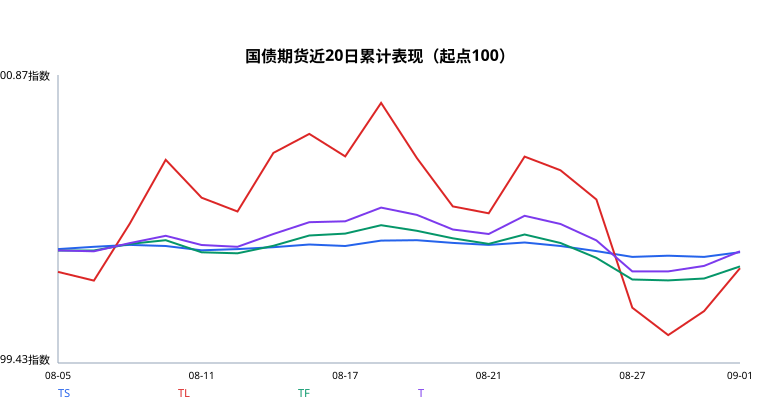
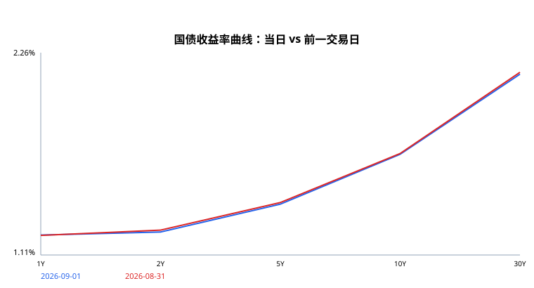
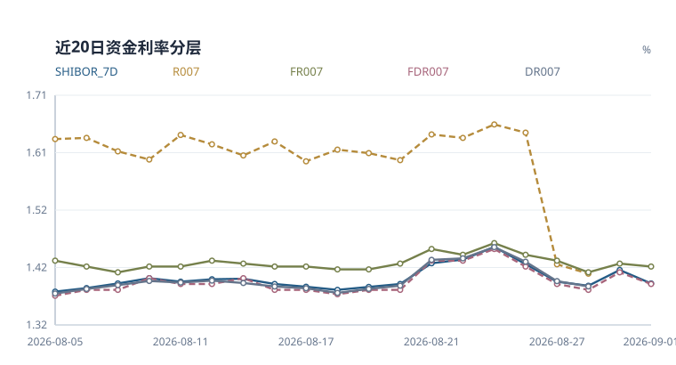

# 中国国债期货每日真实数据监控报告 - 2026-09-01

## 30秒执行摘要
- **结论：中性，中性区间内偏空**；综合评分 -1.00，置信度 86/100。
- **当日变化：** 期货强弱：TL 表现最强（+0.216%），TS 表现最弱（+0.023%）。
- **核心张力：** 有效方向信号未形成明显对冲。
- **下一日关注：** 资金利率分层与长端持仓变化；发行日历不可用：MOF list returned 12 notices but every article request failed。
- 置信度同时反映数据覆盖和多空信号一致性，不是胜率承诺。

## 每日市场判断
- 市场观点：**中性**
- 综合评分：**-1.00**；置信度：**86/100**

## 核心多周期面板
| 指标 | 当前 | 1日变化 | 5日变化 | 20日分位 |
|---|---:|---:|---:|---:|
| 10Y国债收益率 | 1.684% | -0.4 bp | +0.2 bp | 25% |
| FDR007 | 1.390% | -2.0 bp | — | 50% |
| 期货平均收益 | +0.093% | +0.093% | -0.193% | 85% |
| 总成交量 | 257,685 | +1.7% | — | 10% |
| 总持仓量 | 832,755 | -0.3% | -1.0% | 55% |

## 市场结构提示
- 期货强弱：TL 表现最强（+0.216%），TS 表现最弱（+0.023%）。
- 利率曲线：10Y 收益率 1.684%，较上一期 -0.4 bp；10Y-2Y 为 44.1 bp，30Y-10Y 为 45.4 bp。
- 资金锚：FDR007 为 1.390%，较上一期 -2.0 bp，FR007-FDR007 利差 +3.0 bp。
- 公开市场：当日合计净投放 -3810 亿元，操作利率 1.40%。

## 核心驱动与冲突

## 评分拆解
| 维度 | 权重 | 分数 | 可用 | 判断依据 |
|---|---:|---:|---|---|
| 利率方向 | 2.0 | 0.00 | 是 | 10Y 收益率变化未超过方向阈值。 |
| 曲线形态 | 0.5 | 0.00 | 是 | 10Y-2Y 利差处于中性区间。 |
| 资金面 | 1.0 | 0.00 | 是 | FDR007 变化未超过方向阈值。 |
| 公开市场操作 | 1.0 | -1.00 | 是 | 公开市场净回笼 3810 亿元，资金面压力偏空。 |
| 期货量价 | 1.0 | 0.00 | 是 | 期货收益率和成交活跃度未形成同向确认。 |
| 文本信号 | 1.0 | 0.00 | 否 | 缺少政策/新闻文本信号，文本项暂不计分。 |
| 宏观基本面 | 0.5 | 0.00 | 是 | 制造业 PMI 49.8 处于荣枯线附近，宏观基本面中性。 |

## 图表快照

## 期货量价与持仓
| 合约 | 日收益 | 持仓1日变化 | 成交/20日 | 持仓/20日 | 四象限 |
|---|---:|---:|---:|---:|---|
| T | +0.073% | +0.01% | 0.73x | 1.18x | 价涨增仓 |
| TF | +0.061% | -0.39% | 0.69x | 1.09x | 价涨减仓 |
| TL | +0.216% | -0.78% | 0.93x | 1.05x | 价涨减仓 |
| TS | +0.023% | -0.08% | 0.70x | 1.03x | 价涨减仓 |

## 曲线结构
| 结构 | 当前 | 1日变化 | 5日变化 |
|---|---:|---:|---:|
| 2s10s | +44.1 bp | +0.7 bp | -1.2 bp |
| 10s30s | +45.4 bp | -0.7 bp | +0.7 bp |
| 2s5s10s蝶式 | +12.5 bp | +0.4 bp | -1.0 bp |

## 可交割券与基差
- 不可用：缺少逐合约可交割券、转换因子与现券净价，不做估算

## 特征面板
| 分组 | 指标 | 数值 |
|---|---|---:|
| 利率 | 10Y 收益率变化 | -0.0041 |
| 利率 | 30Y 收益率变化 | -0.0110 |
| 利率 | 10Y-2Y 利差 | 0.4414 |
| 利率 | 30Y-10Y 利差 | 0.4542 |
| 资金面 | 资金锚名称 | FDR007 |
| 资金面 | 资金锚水平 | 1.3900 |
| 资金面 | 资金锚变化 | -0.0200 |
| 资金面 | 7天回购分层利差 | 0.0300 |
| 资金面 | Shibor 7D-资金锚 | 0.0010 |
| 资金面 | 可用资金利率 | FDR001, FDR007, FR007, SHIBOR_7D, SHIBOR_ON |
| 公开市场操作 | 公开市场净投放 | -3810.0000 |
| 公开市场操作 | 公开市场操作利率 | 1.4000 |
| 公开市场操作 | 公开市场操作记录数 | 1 |
| 期货量价 | 期货平均日收益率 | 0.0009 |
| 期货量价 | 成交活跃度变化 | -0.0070 |
| 期货量价 | 覆盖合约数量 | 4 |
| 文本 | 文本情绪均值 | 0.0000 |
| 文本 | 文本信号数量 | 0 |
| 宏观基本面 | LPR 1年期 | 3.0000 |
| 宏观基本面 | LPR 5年期以上 | 3.5000 |
| 宏观基本面 | CPI 同比 | 0.5000 |
| 宏观基本面 | PPI 同比 | 3.5000 |
| 宏观基本面 | 制造业 PMI | 49.8000 |
| 宏观基本面 | 宏观指标数量 | 5 |

## 数据来源
| 数据类别 | 来源 |
|---|---|
| 国债期货 | akshare_cffex_daily:20260901 |
| 收益率曲线 | akshare_bond_china_close_return:2026-09-01 |
| 资金利率 | akshare_chinamoney_repo_rate:2026-09-01, akshare_jin10_shibor:2026-09-01 |
| 公开市场操作 | pbc_official:https://www.pbc.gov.cn/zhengcehuobisi/125207/125213/125431/125475/2026090108544487779/index.html |
| 政策/新闻 | 无 |
| 宏观基本面 | akshare_chinamoney_lpr:2026-08-20, akshare_eastmoney_cpi:202607, akshare_eastmoney_pmi:202608, akshare_eastmoney_ppi:202607 |

## 国债期货概览
| 合约 | 收盘价 | 日收益率 | 成交量 | 持仓量 |
|---|---:|---:|---:|---:|
| T | 109.400 | 0.0732% | 79021 | 379217 |
| TF | 106.475 | 0.0611% | 53733 | 199135 |
| TL | 116.130 | 0.2157% | 96127 | 180676 |
| TS | 102.586 | 0.0234% | 28804 | 73727 |

## 收益率曲线概览
| 期限 | 收益率 | 较上一期 |
|---|---:|---:|
| 10Y | 1.684% | -0.4 bp |
| 1Y | 1.225% | +0.2 bp |
| 2Y | 1.242% | -1.1 bp |
| 30Y | 2.138% | -1.1 bp |
| 5Y | 1.401% | -0.9 bp |

## 中债—CFETS 收益率曲线偏差监测
| 期限 | 中债 | CFETS | CFETS − 中债 | 数据日 |
|---|---:|---:|---:|---|
| 1Y | 1.2252% | 1.2252% | +0.00 bp | 2026-09-01 |
| 3Y | 1.2548% | 1.2546% | -0.02 bp | 2026-09-01 |
| 5Y | 1.4004% | 1.4006% | +0.02 bp | 2026-09-01 |
| 10Y | 1.6834% | 1.6838% | +0.04 bp | 2026-09-01 |
| 30Y | 2.1380% | 2.1380% | +0.00 bp | 2026-09-01 |
- 该偏差用于交叉核验发布与拟合口径，不进入每日方向评分，也不代表任一来源错误。

## 资金面概览
| 指标 | 利率 | 较上一期 |
|---|---:|---:|
| FDR001 | 1.360% | -6.0 bp |
| FDR007 | 1.390% | -2.0 bp |
| FR007 | 1.420% | -0.5 bp |
| SHIBOR_7D | 1.391% | -2.3 bp |
| SHIBOR_ON | 1.364% | -4.9 bp |
- 同业存单/IRS分层：不可用：AAA同业存单与FR007 IRS历史接口尚未通过稳定性验证，不与回购利率混用。

## 宏观基本面概览
| 指标 | 数值 | 数据期 |
|---|---:|---|
| CPI 同比 | 0.50% | 2026-07 |
| LPR 1年期 | 3.00% | 2026-08-20 |
| LPR 5年期以上 | 3.50% | 2026-08-20 |
| 制造业 PMI | 49.80 | 2026-08 |
| PPI 同比 | 3.50% | 2026-07 |
- 宏观指标按月度/不定期发布，记录的是运行日可得的最新一期数据。

## 近6期国家统计局宏观趋势
| 数据期 | CPI 同比 | PPI 同比 | 制造业 PMI |
|---|---:|---:|---:|
| 2026-08 | — | — | 49.8 |
| 2026-07 | 0.5% | 3.5% | 49.2 |
| 2026-06 | 1.0% | 4.1% | 50.3 |
| 2026-05 | 1.2% | 3.9% | 50.0 |
| 2026-04 | 1.2% | 2.8% | 50.3 |
| 2026-03 | 1.0% | 0.5% | 50.4 |
- 制造业PMI 较前值改善 +0.6，距50为 -0.2。
- CPI 较前值走弱 -0.5。
- PPI 较前值走弱 -0.6。
- 数据来自国家统计局数据发布页，并按日报运行日截断，避免使用事后发布信息。

## 财政部国债发行日历
| 招标日 | 期限 | 计划发行额 | 官方通知 |
|---|---:|---:|---|
| 数据源不可用，不代表无发行 | — | — | — |
- 展示运行日前财政部已发布、且招标日在运行日前3日至后14日内的记账式国债安排。
- 当前可见窗口计划发行额：0 亿元；到期与净融资缺少同口径官方明细，不做差额估算。
- 招标结果：不可用：尚无经验证的历史招标结果结构化源

## 公开市场操作概览
| 类型 | 期限 | 投放 | 到期 | 净投放 | 来源标题 |
|---|---:|---:|---:|---:|---|
| 逆回购 | 7 天 | 50 亿元 | 3860 亿元 | -3810 亿元 | 公开市场业务交易公告 [2026]第170号 |

## 政策与新闻结构化解读
## 核心驱动
- 公开市场净回笼 3810 亿元，资金面压力偏空。

## 风险提示
- 30Y-10Y 曲线偏陡，可能反映超长端供给或期限溢价扰动。
- 该信号是研究型规则判断，不是价格预测或交易建议。

## 跨市场核验
- 不可用：外围公开接口当前连接不稳定，不纳入生产评分

## 历史信号检验（探索性）
- 历史非中性信号 53 个，次日方向命中率 52.8%，5日方向命中率 46.0%（n=50）。
- 该检验未扣除交易成本，也未做样本外验证，只用于监测规则是否失效。

## 附录：数据状态与新鲜度
| 数据集 | 状态 | 行数 | 观测日 | 来源 | 说明 |
|---|---|---:|---|---|---|
| bond_yields | 正常 | 5 | 2026-09-01 | akshare_bond_china_close_return:2026-09-01 | 采集成功 |
| cross_market | 不可用 | 0 | — | none | 外围公开接口当前连接不稳定，不纳入生产评分 |
| ctd_basis_irr | 不可用 | 0 | — | none | 缺少逐合约可交割券、转换因子与现券净价，不做估算 |
| funding_ncd_irs | 不可用 | 0 | — | none | AAA同业存单与FR007 IRS历史接口尚未通过稳定性验证，不与回购利率混用 |
| funding_rates | 正常 | 5 | 2026-09-01 | akshare_chinamoney_repo_rate:2026-09-01, akshare_jin10_shibor:2026-09-01 | 采集成功 |
| futures_quotes | 正常 | 4 | 2026-09-01 | akshare_cffex_daily:20260901 | 采集成功 |
| macro_history | 正常 | 18 | 2026-08-31 | nbs_official_release | 获取 18/18 条官方宏观历史 |
| macro_indicators | 正常 | 5 | 2026-09-01 | akshare_chinamoney_lpr:2026-08-20, akshare_eastmoney_cpi:202607, akshare_eastmoney_pmi:202608, akshare_eastmoney_ppi:202607 | 采集成功 |
| open_market_operations | 正常 | 1 | 2026-09-01 | pbc_official:https://www.pbc.gov.cn/zhengcehuobisi/125207/125213/125431/125475/2026090108544487779/index.html | 采集成功 |
| policy_news | 不可用 | 0 | 2026-09-01 | none | AkShare 无目标日历史电报，且 Tushare news 无权限 |
| treasury_auction_results | 不可用 | 0 | — | none | 尚无经验证的历史招标结果结构化源 |
| treasury_issuance_calendar | 不可用 | 0 | — | mof_official_notice | MOF list returned 12 notices but every article request failed |
| yield_curve_comparisons | 正常 | 5 | 2026-09-01 | chinabond+cfets | 中债与 CFETS 共同日曲线齐全 |

## 附录：数据真实性检查
- 国债期货合约：4 条；收益率期限：5 条；资金利率：5 条。
- 公开市场操作：1 条；新闻：0 条；宏观：5 条。
- 当日真实数据合计：43 条。核心覆盖不足会直接失败。

## 数据库写入结果
- database: data/bond_futures_monitor.db
- futures_quotes: 4 rows
- bond_yields: 5 rows
- funding_rates: 5 rows
- open_market_operations: 1 rows
- policy_news: 0 rows
- macro_indicators: 5 rows
- macro_history: 18 rows
- treasury_issuance_calendar: 0 rows
- yield_curve_comparisons: 5 rows
- ai_text_signals: 0 rows
- daily_features: 1 row
- daily_market_signals: 1 row
- run_status: success

## 方法说明
文本层用于把真实政策/新闻转成固定 schema 的利率债研究信号；规则评分用于解释当日数据含义，不直接预测价格。
